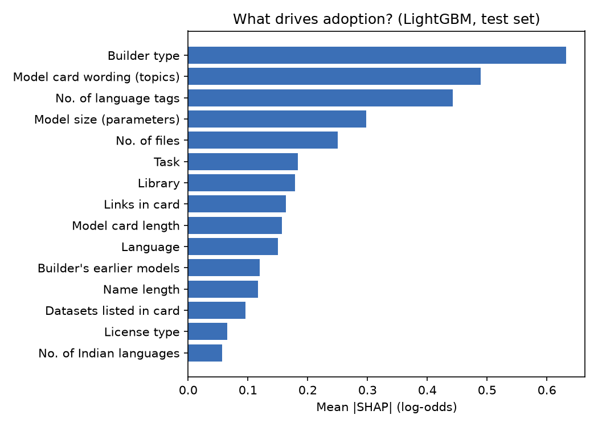
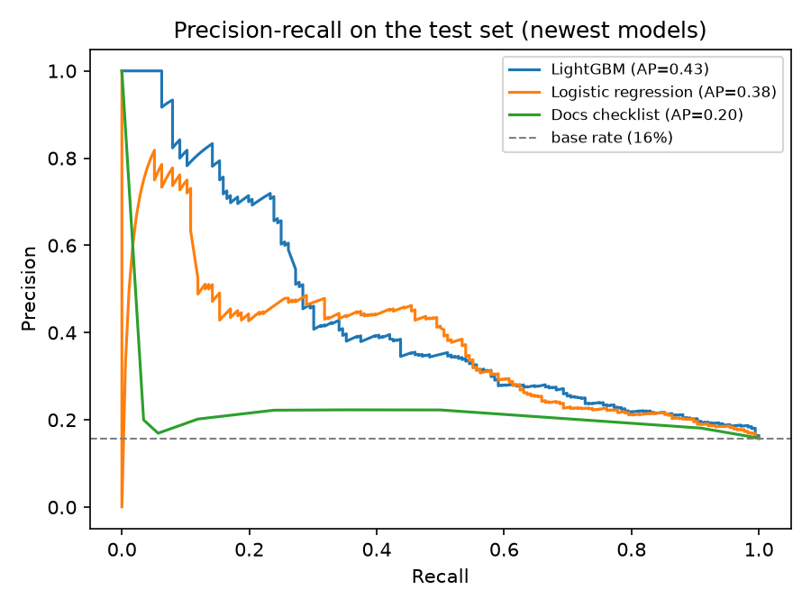

# ✨ Atlas-Nakshatra: Predicting Which Indian-Language AI Models Become Stars

> **Thousands of AI models are published for India's languages, but most go unused. Can we predict at launch which ones will be adopted, and tell builders what to change?**

*Nakshatra* (नक्षत्र) means "star". This is the data science sequel to my analytics project **[Bharat AI Atlas](https://github.com/Karan-More214/Bharat-AI-Atlas)**, which found that downloads of Indian-language AI are extremely concentrated: 41 models get 80% of all downloads and 11.8% are never downloaded. Bharat AI Atlas *described* that inequality. Atlas-Nakshatra *predicts and explains* it.

| | Bharat AI Atlas (analyst) | Atlas-Nakshatra (data scientist) |
|---|---|---|
| Question | What exists, who builds it, who uses it? | Which new models will be used, and why? |
| Methods | SQL, Power BI | scikit-learn, LightGBM, NLP on model cards, SHAP, calibration |
| Output | Dashboard | Trained model + Launch Checker app |

---

## 🔑 Results
Trained on 7,440 eligible Hugging Face models tagged with an Indian language, after excluding repackaged models (5,208 train / 1,116 validation / 1,116 test, split chronologically: train ends 2026-02-17, test starts 2026-04-21). Adoption rate is 16.8% / 15.9% / 15.8% across the three splits.

- **Final model:** LightGBM, calibrated · **PR-AUC 0.43** on the newest 1,116 models (base rate 0.16) · **ROC-AUC 0.74**. On validation: PR-AUC 0.44 (base rate 0.16), ROC-AUC 0.70. Both beat the base-rate and documentation-checklist baselines (test PR-AUC 0.16 and 0.20; see `reports/model_comparison.csv`).
- The top 10% of models by predicted probability are adopted **2.9× more often** than average (46% vs. 16%) — max possible lift is `1 / base rate` ≈ 6.3, so the model captures under half of the theoretical best.
- At the chosen threshold (0.36): precision 0.70, recall 0.20 (F1 0.31) — it flags a smaller, higher-confidence set of models rather than most future adoptees.
- **Top 10 drivers** (by mean |SHAP|, direction where it's a single higher/lower relationship): builder type (see categories), model card wording/topics, number of language tags (higher → more adoption), model size in parameters (mixed), number of files (mixed), task (see categories), library (see categories), links in the card (higher → more adoption), model card length (higher → more adoption), language (see categories).
- **Robustness check:** retraining at a stricter threshold (≥100 downloads/30d instead of ≥50) gives the same top 5 drivers in the same order, so this isn't an artifact of one specific threshold.

These are launch-time associations the model found useful for prediction, not proven causes — see [Doing it honestly](#-doing-it-honestly). Adding a link or writing a longer card does not, by itself, guarantee more downloads.




## ❓ Problem framing
- **Unit:** one Hugging Face model tagged with at least one of India's 22 official languages.
- **Target (`is_adopted`):** at least **50 downloads in the last 30 days** at the snapshot date, i.e. the model is still being used. The threshold is set in `src/config.py` / `ADOPTION_MIN_DOWNLOADS_30D`. (10 was tried first and gave a 62-74% "adopted" rate by split — too easy a bar to be useful; 50, with repackaged models excluded, lands in a 15-30% adoption range instead.)
- **Who is eligible:** models with a real created date that are **90 days to 3 years old**. Younger models haven't had time to be found. Models from before March 2022 carry Hugging Face's placeholder date and are excluded.
- **Repackaged models are excluded by default** (`EXCLUDE_REPACKAGED=1` in `src/config.py`) — see [Why repackaged models are excluded](#-why-repackaged-models-are-excluded) below.
- **Features:** only what a builder controls or knows **at launch**:

| Group | Examples |
|---|---|
| What it is | task, library, language, number of languages, dedicated to one Indian language |
| Where it comes from | base model provider (Meta, OpenAI, Google…), fine-tune / adapter / quantized |
| Who built it | builder type, Indian builder, number of earlier models by the same author |
| Packaging | safetensors / GGUF / ONNX weights, tokenizer files, parameter count, repo size, gated access |
| Openness | license group (permissive, non-commercial, model-specific…) |
| Documentation | card length, headings, code examples, usage / training data / evaluation / limitations / citation sections, unedited template text, structured eval results, datasets and metrics listed |
| Card wording | TF-IDF of the model card compressed to 20 topics (SVD) |
| Name | test/demo-style name, name length |

## 🧹 Why repackaged models are excluded
Quantized re-uploads, GGUF conversions and models from accounts classified as a "Model Repackager" (the biggest by far is `mradermacher`, an account that auto-publishes GGUF quantizations of other people's models) are not "adopted" in the sense this project cares about — they get pulled by automated tools (llama.cpp, LM Studio, Ollama and similar) regardless of whether anyone is choosing that specific model.

- They're 38.6% of eligible models, but adopted (≥10 downloads/30d) **89%** of the time, vs. **56%** for everything else. The gap holds at every threshold tried (10 through 500).
- The "links in the card" driver looked partly like a repackaging artifact: among the highest-link cards, several of the top "adopted" *and* top "not adopted" examples were `mradermacher`'s auto-generated GGUF cards, which list one link per quantization file plus a fixed boilerplate template (base model, a mirror site, a copy-pasted link to an unrelated repo) rather than genuine documentation. It isn't a data leak — no download counts appear in the card text — but it is a repackaging signal, not a builder-quality one.

`EXCLUDE_REPACKAGED=1` (the default, in `src/config.py`) removes `base_relation == "quantized"`, `has_gguf == 1` and `org_type == "Model Repackager"` before training, so the model learns from models people actually chose to publish and use, not from a quantization farm's throughput. Set `EXCLUDE_REPACKAGED=0` to include them again.

## 🛡️ Doing it honestly
- **No leakage.** Downloads, likes, trending score, Spaces and child models are outcomes and never features. `tests/test_features.py` fails if one sneaks in.
- **Chronological split.** Train = oldest 70% of models, validation = next 15%, test = newest 15%. This mimics the real use: score models that did not exist when the model was trained.
- **Test set used once.** Hyper-parameters, the choice between logistic regression and LightGBM, probability calibration (Platt) and the decision threshold are all chosen on validation.
- **Baselines first.** Every model is compared with guessing the base rate and with a simple documentation-checklist score.
- **Right metric.** Adoption is rare, so the main metric is **PR-AUC**, plus ROC-AUC, Brier score and precision in the top 10%.
- **Association, not causation.** SHAP and the app's "what would help" suggestions show what the model associates with adoption. They are hypotheses, not proof that editing a card causes downloads.

## 🏗️ Pipeline
```
Hugging Face Hub API
   │  collect.py      metadata + card data + files + params + eval results   → data/raw/models_raw_<date>.parquet
   │  fetch_cards.py  README.md model cards (cached, resumable)              → data/raw/cards/cards.jsonl
   ▼
build_dataset.py      target, eligibility, features (features.py), time split → data/processed/dataset.parquet
   ▼
train.py              baselines → logistic regression → LightGBM → calibration → models/atlas_nakshatra.joblib
   ▼
explain.py            SHAP importance, adoption by group, findings draft     → reports/
   ▼
predict.py + app/     Launch Checker: probability, drivers, suggested fixes
```

## 🖥️ Launch Checker app
```bash
streamlit run app/streamlit_app.py
```
- **Check a published model:** paste a Hugging Face model ID and get its adoption probability, the top SHAP drivers, and the changes that would raise it most.
- **Plan a new model:** describe a model before publishing it (language, task, license, base model, card sections) and see its predicted adoption.

## ▶️ How to run
```bash
git clone https://github.com/Karan-More214/Atlas-Nakshatra.git
cd Atlas-Nakshatra
python -m venv venv && venv\Scripts\activate          # Mac/Linux: source venv/bin/activate
pip install -r requirements.txt
copy .env.example .env                                 # Mac/Linux: cp; add your HF token

python src/run_pipeline.py --limit 200                 # quick test on a small sample
python src/run_pipeline.py                             # full run (card download takes a while)
python src/predict.py --model-id ai4bharat/indic-bert  # score one model from the terminal
python -m pytest -q tests
```

**Offline demo.** To check the code without internet, use synthetic data. It is written to separate `demo/` folders and never mixes with real data. Its numbers mean nothing.
```bash
python src/run_pipeline.py --demo
set ATLAS_DEMO=1                                  # Mac/Linux: export ATLAS_DEMO=1
streamlit run app/streamlit_app.py
```

## 📁 Repository structure
```
├── config/        languages.csv, author_mapping.csv (shared with Bharat AI Atlas)
├── src/           config, collect, fetch_cards, features, build_dataset, train, explain, predict, run_pipeline, make_demo_data
├── app/           streamlit_app.py (Launch Checker)
├── tests/         leakage, split and feature tests
├── data/          raw + processed (git-ignored)
├── models/        trained model (git-ignored)
└── reports/       metrics, model comparison, SHAP, figures
```

## ⚠️ Limitations
- **One snapshot.** Card, files and license are read at the snapshot date, not at launch, so a card improved after a model became popular looks "launch-time" here. Weekly snapshots (as in Bharat AI Atlas) would fix this.
- `downloads` counts are global, and include automated and CI downloads. They measure use, not use in India. A first pass at 10 downloads/30d gave a 56-89% "adopted" rate depending on how repackaged models were handled — clearly too easy a bar — which is why the target is 50 downloads/30d with repackaged models excluded (see [Why repackaged models are excluded](#-why-repackaged-models-are-excluded)).
- The Hugging Face API no longer accepts `usedStorage` as an `expand` field, so repo-size-on-disk (`log_storage_mb`) cannot currently be collected and is a dead feature (always missing, median-imputed to nothing). Repo size would need to be estimated another way (e.g. per-file sizes from `repo_info`) to be useful again.
- Builder type is mapped by hand for 215 authors, so most small authors are "Unclassified".
- Language tags can be wrong (see Bharat AI Atlas), and documentation features overlap, so read SHAP for groups of related features rather than one feature at a time.
- Author concentration is much lower once repackaged models are excluded: the largest single author is 3.0% of train and 4.9% of test (previously `mradermacher` alone was 9.4% of train before exclusion).

## 🚀 Next steps
- **Language tag checker:** detect mislabelled models with language ID on card text.
- **Language gap forecast:** forecast dedicated models per language with uncertainty intervals.
- FastAPI endpoint, Docker image and MLflow tracking (`train.py` already logs to MLflow if it is installed).

---
**Author:** Karan More · [LinkedIn](https://www.linkedin.com/in/karan-more21) · [GitHub](https://github.com/Karan-More214) · Data: [Hugging Face Hub](https://huggingface.co)
